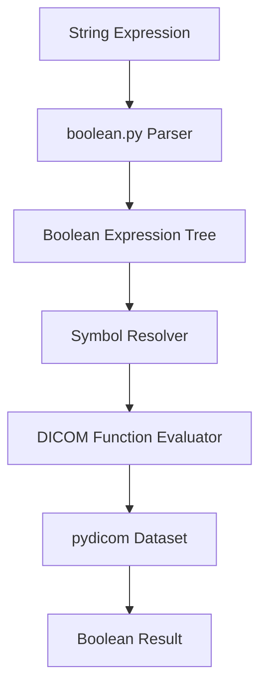

# Design Document

## Overview

The DICOM Criterion class provides a flexible way to define and evaluate boolean expressions for DICOM attribute validation. The design leverages the boolean.py library for expression parsing and evaluation, while integrating with pydicom for DICOM data access. The class supports three core functions (equals, contains, exists) that can be combined using standard boolean operators.

## Architecture

The system follows a layered architecture:

1. **Expression Layer**: Handles string parsing and boolean expression creation using boolean.py
2. **Function Layer**: Implements DICOM-specific validation functions (equals, contains, exists)
3. **Evaluation Layer**: Evaluates expressions against pydicom Dataset objects
4. **Error Handling Layer**: Provides meaningful error messages for invalid expressions or evaluation failures



## Components and Interfaces

### Criterion Class

```python
class Criterion:
    def __init__(self, expression: str) -> None
    def evaluate(self, dataset: pydicom.Dataset) -> bool
    def __str__(self) -> str
    def __repr__(self) -> str
```

### DICOM Function Interface

```python
class DicomFunction(ABC):
    @abstractmethod
    def evaluate(self, dataset: pydicom.Dataset, attribute: str) -> bool
```

### Concrete Function Classes

- **EqualsFunction**: Checks if DICOM attribute equals a specific value
- **ContainsFunction**: Checks if DICOM attribute contains a substring
- **ExistsFunction**: Checks if DICOM attribute is present in the dataset

### Symbol Parser

Responsible for parsing DICOM attribute expressions in Python function call format:
`attribute.function(argument)` or `attribute.function()`

Examples:
- `PatientName.equals('John Doe')`
- `StudyDescription.contains('MRI')`
- `PatientID.exists()`

## Data Models

### Expression Symbol Structure

```python
@dataclass
class DicomSymbol:
    attribute: str          # DICOM attribute name or tag
    function: str          # Function name (equals, contains, exists)
    argument: Optional[str] # Function argument (None for exists)
    
    def to_boolean_symbol(self) -> str
    def evaluate(self, dataset: pydicom.Dataset) -> bool
```

### Function Registry

```python
class FunctionRegistry:
    _functions: Dict[str, Type[DicomFunction]]
    
    def register(self, name: str, func_class: Type[DicomFunction]) -> None
    def get_function(self, name: str) -> DicomFunction
    def is_registered(self, name: str) -> bool
```

## Error Handling

### Exception Hierarchy

```python
class CriterionError(Exception):
    """Base exception for Criterion-related errors"""

class ExpressionParseError(CriterionError):
    """Raised when expression cannot be parsed"""

class SymbolParseError(CriterionError):
    """Raised when DICOM symbol format is invalid"""

class FunctionNotFoundError(CriterionError):
    """Raised when referenced function is not registered"""

class EvaluationError(CriterionError):
    """Raised when expression evaluation fails"""
```

### Error Handling Strategy

1. **Parse-time errors**: Validate expression syntax and symbol format during initialization
2. **Runtime errors**: Handle missing attributes gracefully based on function semantics
3. **Type errors**: Validate DICOM attribute types against function expectations
4. **Clear messages**: Provide specific error messages indicating the problem location

## Testing Strategy

### Unit Tests

1. **Expression Parsing Tests**
   - Valid boolean expressions with various operators
   - Invalid syntax handling
   - Parentheses and precedence validation

2. **Symbol Parsing Tests**
   - Valid DICOM symbol formats
   - Invalid symbol format handling
   - Edge cases with special characters

3. **Function Tests**
   - Each DICOM function with various inputs
   - Missing attribute handling
   - Type conversion and validation

4. **Integration Tests**
   - Complete expression evaluation with real DICOM datasets
   - Complex nested expressions
   - Error propagation through the evaluation chain

### Test Data

- Sample DICOM datasets with known attribute values
- Edge cases: empty datasets, missing attributes, various data types
- Invalid expressions for error testing

### Performance Tests

- Large boolean expressions with many symbols
- Repeated evaluations of the same expression
- Memory usage with complex expression trees

## Dependencies

### Required Libraries

- **boolean.py**: Core boolean expression parsing and evaluation
- **pydicom**: DICOM dataset handling and attribute access
- **typing**: Type hints for better code clarity

### Integration Points

1. **boolean.py Integration**
   - Custom symbol class that implements boolean.py's Symbol interface
   - Expression parsing using boolean.py's parse() function
   - Evaluation using boolean.py's evaluation methods

2. **pydicom Integration**
   - Dataset attribute access using pydicom's tag and keyword systems
   - Type handling for various DICOM value representations
   - Error handling for missing or invalid attributes